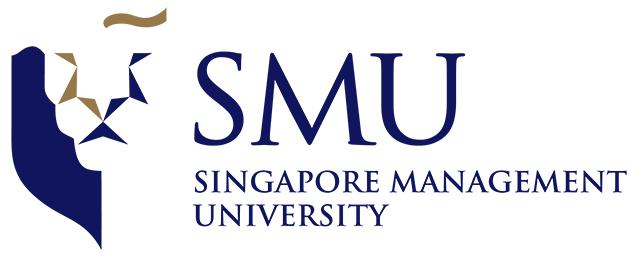

---
permalink: /
title: "About"
excerpt: "About me"
author_profile: true
redirect_from: 
  - /about/
  - /about.html
--- 
<!---    --->

<!---  ** Welcome to my site!** --->

<!---##  Welcome to my site! --->   

 
------

 

### Bio
I am currently a Ph.D. candidate in the [School of Economics](https://economics.smu.edu.sg/), [Singapore Management University (SMU)](https://www.smu.edu.sg/). My research interests lie in labor and family economics with three core areas of research: intra-household decisions, gender inequality, and child development. My work involves reduced-form and structural modelling approaches. Recent projects aim to explore the implications of parental investments in child quantity and quality, fertility and female labor supply behaviors..

Here is my [CV](../files/CV_Yutao_Wang.pdf). You can reach me at [ytwang.2020@phdecons.smu.edu.sg](mailto:ytwang.2020@phdecons.smu.edu.sg).

<!--- ------ --->
### Research Interests
  <!-- Economics of the Family, Labor Economics -->
  Labor Economics, Development Economics, Applied Microeconomics, Economics of the Family

<!---
### Education
 &nbsp;&nbsp;&nbsp;Ph.D. Candidate in Economics | <small>2020 - Now</small>
 &nbsp;&nbsp;&nbsp;Singapore Management University
 &nbsp;&nbsp;&nbsp;Advisor: [Prof. Christine Ho](https://sites.google.com/site/christineho5/)
--->
  
<!---
### Contact Information
  Email: [ytwang.2020@phdecons.smu.edu.sg](mailto:ytwang.2020@phdecons.smu.edu.sg)
--->
